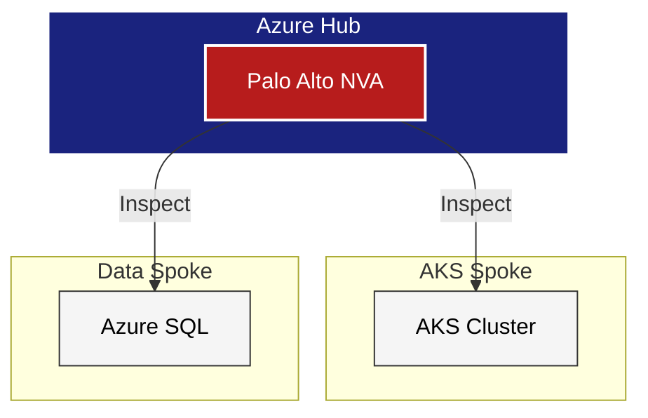

> **Context:** Need to deploy 10+ regions rapidly.
> **Solution:** Moved from "Scripting" to "Module Factories." Embedded Palo Alto security and Finance tags into the base Terraform modules.
> **Outcome:** Deployed 10+ geo-redundant environments in days, not months.

## Architecture Diagram

