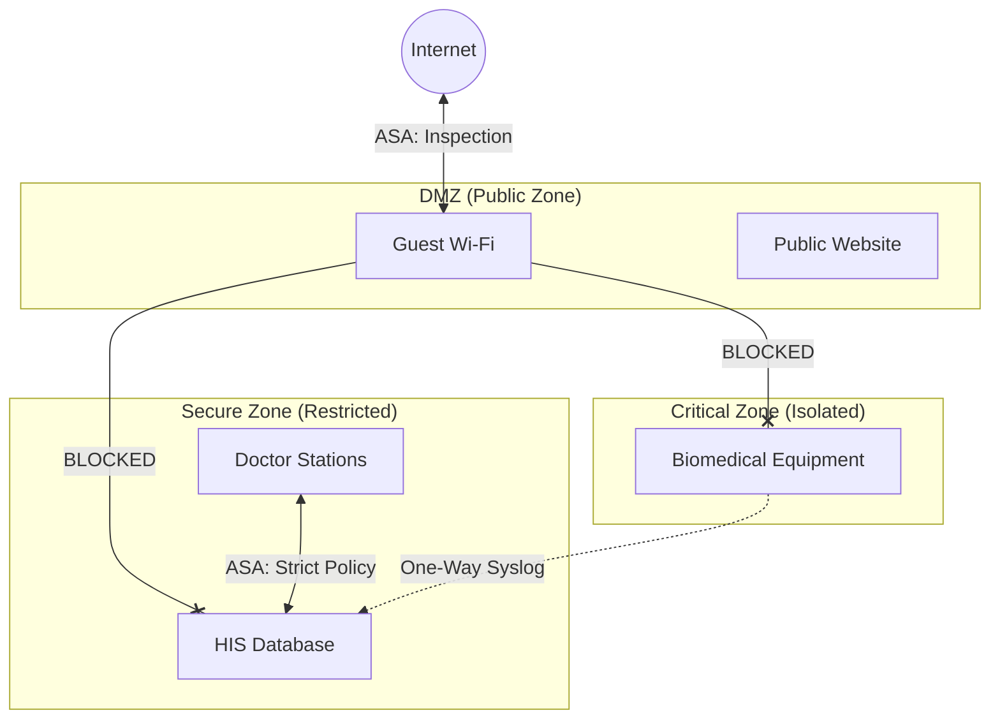

# The Challenge

**Artemis Hospital**, a premier healthcare facility, required a digital backbone that balanced life-critical reliability with ironclad security.
The network had to support two conflicting requirements:

1. **Open Access:** Guest Wi-Fi for patients/families and VoIP for staff.
2. **Zero Trust:** Absolute isolation for the **Hospital Information System (HIS)** containing sensitive patient records and the **Biomedical Network** connecting life-support devices.

**The Risk:** A malware infection from a guest's laptop could theoretically jump to the HIS or, worse, a connected ventilator.

# The Solution

I implemented a rigid **Zone-Based Security Architecture**. We didn't rely on simple ACLs; we relied on **Physical Segmentation**.

**The Tech Stack:**

* **Firewall:** Cisco ASA 5500 Series
* **Core:** Cisco Catalyst 6500 Switches
* **Isolation:** Air-gapped VLANs and DMZ

**Key Innovation: Physical Segmentation**
We treated the Bio-Medical network as a "Hostile Zone."

* **HIS Network:** Housed in a secure VLAN with no internet access. Only specific doctor terminals could access it via a whitelisted proxy.
* **Biomedical Network:** Completely isolated. Data export was one-way.
* **Public Network:** Physically separated on distinct switch interfaces in the Core, routed through a strict DMZ on the ASA.

# Architecture: The Traffic Flow

We ensured that "East-West" traffic between zones was impossible without passing through the firewall inspection engine.

# Business Impact

* **Security:** Achieved **Zero Breaches** of Patient Data during my tenure. The malware outbreaks that affected the Guest Wi-Fi never crossed the DMZ barrier.
* **Operations:** Maintained **100% Uptime** for the HIS network. Doctors never lost access to patient records during critical surgeries.
* **Compliance:** Met strict healthcare data privacy standards by proving physical and logical isolation of data.
