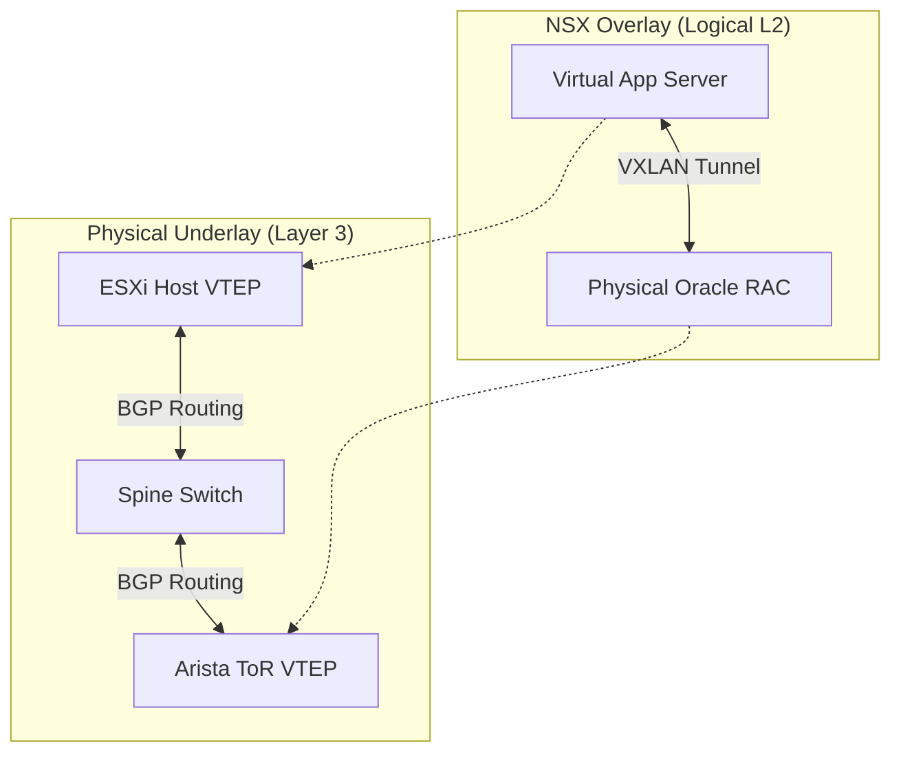

# The Challenge

The client, a manufacturing giant, had a strict requirement: **Migrate the Data Center to the Cloud, but do not change IP addresses.**

The catch? Their application stack was a mix of:

* **Virtual Web/App Utility:** Standard Linux VMs (Easy to migrate).
* **Physical Database:** Legacy **Oracle RAC** clusters running on bare metal performance hardware (Impossible to virtualize).

They needed the Virtual Apps (in the Cloud) to talk to the Physical DBs (also in the Cloud, on Bare Metal) as if they were on the same Layer 2 subnet.

# The Solution

We built a **Hybrid Cloud SDDC** on IBM Cloud Bare Metal.

**The Tech Stack:**

* **Overlay:** VMware NSX-V (VXLAN)
* **Underlay:** Arista Switches (Hardware VTEP)
* **Connectivity:** IBM Cloud Direct Link

**Key Innovation: Hardware VTEP Integration**
We couldn't put the Oracle RAC nodes inside NSX because they were physical. So, we brought the NSX Overlay *to them*.
We configured the Top-of-Rack Arista switches to act as **Hardware VTEPs (VXLAN Tunnel Endpoints)**.

The Arista switch encapsulated the physical frames from the Oracle servers into VXLAN packets and shot them into the NSX Overlay. To the Virtual App servers, the Oracle DB looked like just another VM on the same logical switch.

# Architecture: Underlay vs. Overlay

The routing complexity was extreme. We had to maintain two distinct routing tables:

1. **The Underlay (BGP):** Handling the transport of VXLAN packets between the ESXi hosts and the Arista Switches.
2. **The Overlay (OSPF):** Handling the actual traffic between the Applications and the Database inside the tunnels.

# Business Impact

* **Migration:** Successfully lifted and shifted **500+ workloads** with **Zero IP Changes**.
* **Performance:** Achieved **Line-Rate Throughput** (10Gbps) for database replication, as the VXLAN encapsulation was done in ASICs, not CPU.
* **Continuity:** The application owners didn't even know they had moved.
